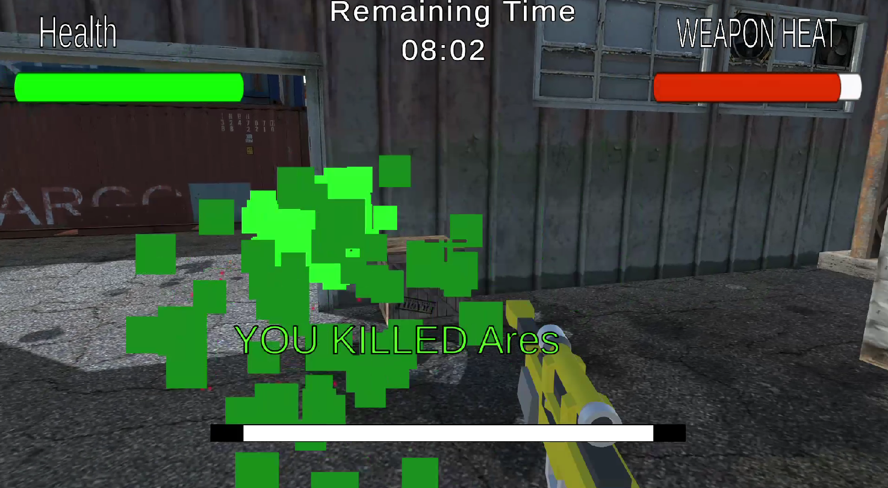
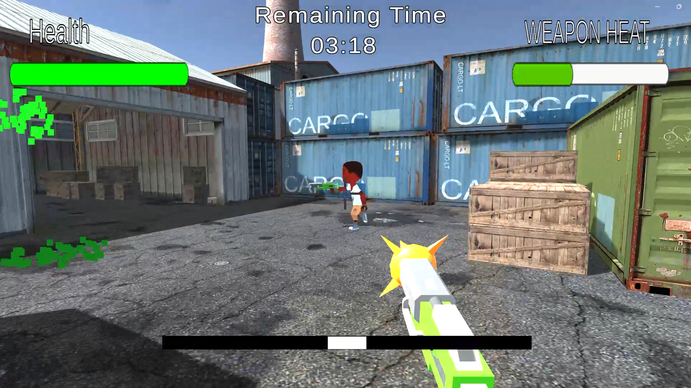
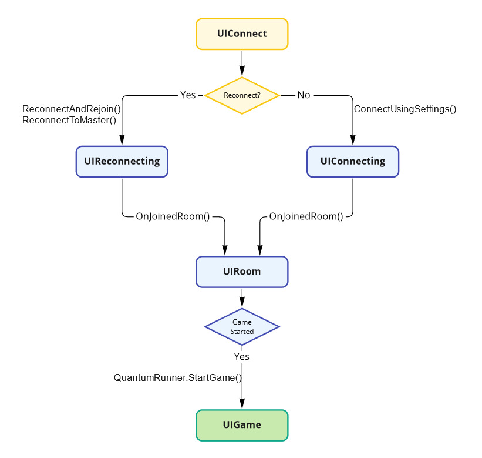
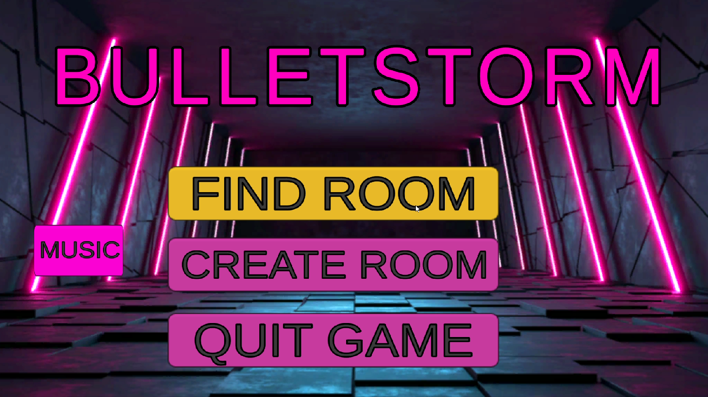
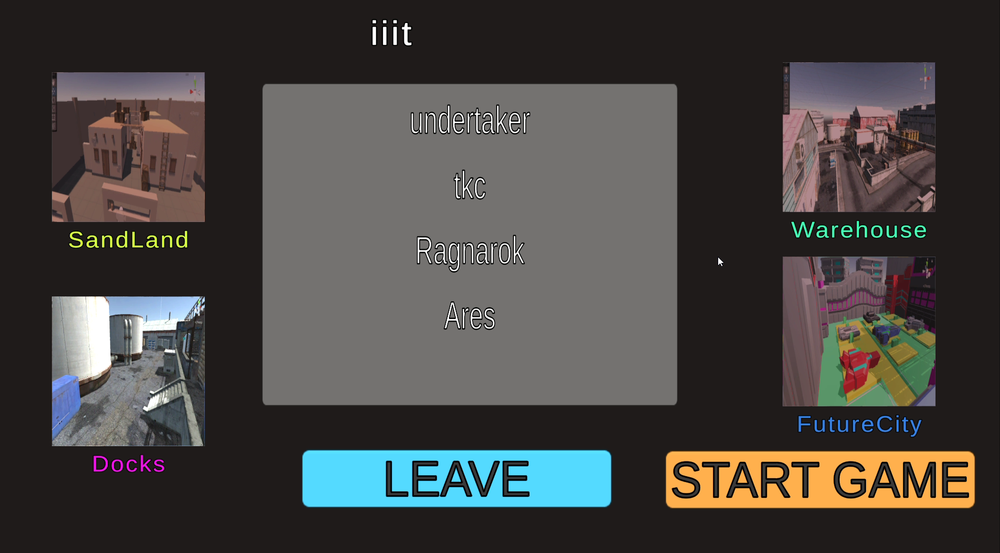
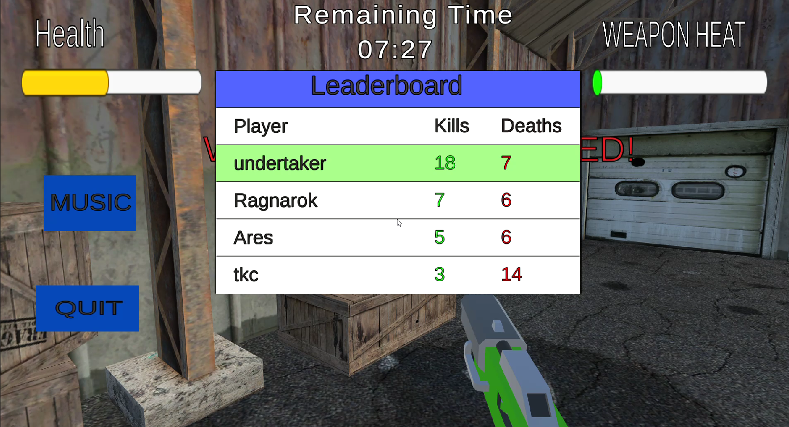

# Bulletstorm

Bulletstorm is a fast-paced multiplayer battle royale game built in Unity. Players battle across diverse maps, using weapons and tactics to outlast opponents. It's all about quick reflexes, strategic thinking, and intense competition for survival.

## Demo Video

[](https://www.youtube.com/watch?v=hJyXcGWY1bY&ab_channel=SamarthYadav)

## Gameplay

In Bulletstorm, players compete in a dynamic and fast-paced battle royale environment. The objective is to eliminate as many opponents as possible within a given time limit. The player with the most kills at the end of the match wins. Use strategy, skill, and the diverse weaponery available to dominate the battlefield and emerge victorious.



## Play Now

[Play Bulletstorm](https://samarth-717.itch.io/bulletstorm)

## Features

- **First-Person Shooter**: Engage in intense first-person combat with a variety of weapons.
- **Multiplayer Battle Royale**: Compete against other players in a battle royale format.
- **Four Unique Maps**: Explore and fight in four different maps, each with its own unique terrain and challenges.
- **Weapon Variety**: Choose from a range of weapons, including pistols, machine guns, and sniper rifles, each with unique parameters.
- **Photon Integration**: Utilizes Photon's RPCs and event callbacks for multiplayer interactions.



## Photon Networking


### Creating a Room


To create a room in Bulletstorm using Photon Networking, you first need to initialize Photon in your project. Once initialized, you can create a room with specific options such as visibility, openness, and maximum number of players. This allows you to set up game sessions where other players can join and compete.

### Joining a Room


Players can join existing rooms either by selecting a specific room or by joining a random room. Photon provides functionality to handle both cases, ensuring that players can easily find and join games. Callbacks are used to handle the success or failure of room joining attempts, allowing you to implement custom logic for each scenario.

### Handling Callbacks

Photon provides callbacks to manage the syncing of player data over the network, such as kills and deaths. For instance, implementing logic to handle what happens when a player's kill or death data is successfully updated or when there's an attempt to sync this data that fails. This ensures a smooth multiplayer experience and provides proper feedback to the players.



## Contributing

1. **Fork the repository**.
2. **Create a new branch**:
    ```bash
    git checkout -b feature-branch
    ```
3. **Make your changes**.
4. **Commit your changes**:
    ```bash
    git commit -m "Add some feature"
    ```
5. **Push to the branch**:
    ```bash
    git push origin feature-branch
    ```
6. **Open a pull request**.

## License

This project is licensed under the MIT License. See the [LICENSE](LICENSE) file for details.

## Contact

For any questions or feedback, please contact us at smartsamarth77@gmail.com.
